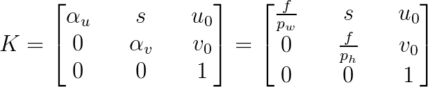
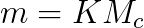
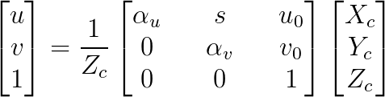
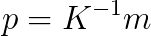

[BACK](https://mcarletti.github.io/)

*Last update: October 19th, 2018*

# Extract the intrinsic parameters in Blender

The **intrinsic matrix K** is a 3x3 matrix containing a set of parameters: focal length, image sensor format, skew and principal point.

<center>

</center>

where `f` is the focal length (mm), `pw` and `ph` are the dimensions of one pixel in world coordinates (mm) and `u0` and `v0` are the principal point (i.e. the central point of the image frame).

`K` maps the homogeneous 3D coordinates of a point `Mc` (in camera space) to its 2D projections on the image plane `m`:

<center>

</center>
that is
<center>

</center>

The inverse operation is not possibile since this projection function is lossy, that is the Z coordinates is lost. As a matter of fact, we can only compute the direction `p`, in camera space, where `Mc` lies. Note that this vector has its third value (z) equal to 1:

<center>

</center>

It's a shame that in Blender you cannot define directly the camera matrix `K`. To emulate a specific camera model, you need to know a set of measures:

* focal length [mm]
* image frame resolution [pixel]
* sensor/pixel resolution [mm]

For example, to emulate the depth sensor of the Kinect V1, we set these values as follow:

```matlab
% Kinect V1 depth camera specs
focal_length    = 20.6
frame_width     = 640
frame_height    = 480
sensor_width    = 1
sensor_height   = 1
```

In order to extract the corresponding camera matrix, use this function:

```python
import bpy
import numpy as np

def get_calibration_matrix_K_from_blender(mode='simple'):

    scene = bpy.context.scene

    scale = scene.render.resolution_percentage / 100
    width = scene.render.resolution_x * scale # px
    height = scene.render.resolution_y * scale # px

    camdata = scene.camera.data

    if mode == 'simple':

        aspect_ratio = width / height
        K = np.zeros((3,3), dtype=np.float32)
        K[0][0] = width / 2 / np.tan(camdata.angle / 2)
        K[1][1] = height / 2. / np.tan(camdata.angle / 2) * aspect_ratio
        K[0][2] = width / 2.
        K[1][2] = height / 2.
        K[2][2] = 1.
        K.transpose()
    
    if mode == 'complete':

        focal = camdata.lens # mm
        sensor_width = camdata.sensor_width # mm
        sensor_height = camdata.sensor_height # mm
        pixel_aspect_ratio = scene.render.pixel_aspect_x / scene.render.pixel_aspect_y

        if (camdata.sensor_fit == 'VERTICAL'):
            # the sensor height is fixed (sensor fit is horizontal), 
            # the sensor width is effectively changed with the pixel aspect ratio
            s_u = width / sensor_width / pixel_aspect_ratio 
            s_v = height / sensor_height
        else: # 'HORIZONTAL' and 'AUTO'
            # the sensor width is fixed (sensor fit is horizontal), 
            # the sensor height is effectively changed with the pixel aspect ratio
            pixel_aspect_ratio = scene.render.pixel_aspect_x / scene.render.pixel_aspect_y
            s_u = width / sensor_width
            s_v = height * pixel_aspect_ratio / sensor_height

        # parameters of intrinsic calibration matrix K
        alpha_u = focal * s_u
        alpha_v = focal * s_v
        u_0 = width / 2
        v_0 = height / 2
        skew = 0 # only use rectangular pixels

        K = np.array([
            [alpha_u,    skew, u_0],
            [      0, alpha_v, v_0],
            [      0,       0,   1]
        ], dtype=np.float32)
    
    return K
```