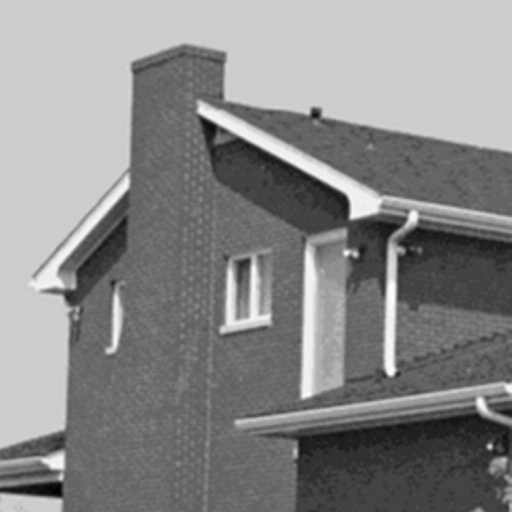
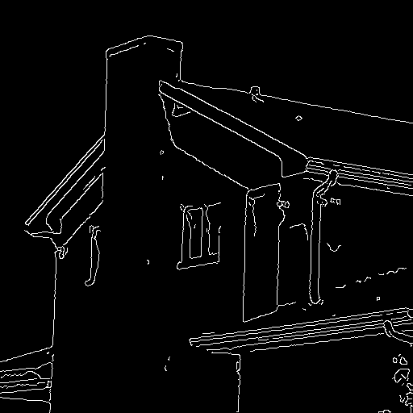
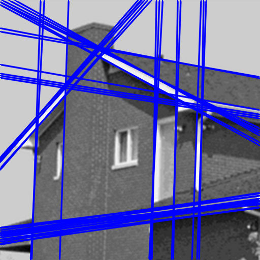

[BACK](https://mcarletti.github.io/)

*Last update: October 7th, 2018*

# Line detection

In image processing, line detection is an algorithm that takes a collection of n edge points and finds all the lines on which these edge points lie. The most popular line detectors are the *Hough transform* and convolution based techniques.

Here, the OpenCV implementation of the *Hough transform* is shown, both in Python and C++.

## Hough transform

The Hough transform is a feature extraction technique aiming to find imperfect instances of objects within a certain class of shapes by a voting procedure.

The Hough transform as it is universally used today was invented by Richard Duda and Peter Hart in 1972, who called it a "generalized Hough transform" after the related 1962 patent of Paul Hough.

The simplest case of Hough transform is detecting straight lines. In general, the straight line `y = mx + b` can be represented as a point `(b,m)` in the parameter space. However, vertical lines pose a problem.

It is therefore possible to associate with each line of the image a pair `(r,θ)`. The `(r,θ)` plane is sometimes referred to as Hough space for the set of straight lines in two dimensions.

<center>


</center>

Given a single point in the plane, then the set of all straight lines going through that point corresponds to a sinusoidal curve in the `(r,θ)` plane, which is unique to that point. A set of two or more points that form a straight line will produce sinusoids which cross at the `(r,θ)` for that line. Thus, the problem of detecting collinear points can be converted to the problem of finding concurrent curves.

Source: Wikipedia


# Code

<center>



</center>

The function we need to find straight lines is:

```cpp
void cv::HoughLines	(
    InputArray  image,            // source image (edges)
    OutputArray lines,            // output vector of lines
    double      rho,              // spatial resolution in pixels
    double      theta,            // angle resolution in radians
    int         threshold,        // minimum vote (number of points)
    double      srn = 0,          // multi-scale HT divisor for rho (>=0)
    double      stn = 0,          // multi-scale HT divisor for angle (>=0)
    double      min_theta = 0,    // minimum angle to check for lines (between 0 and max_theta)
    double      max_theta = CV_PI // maximum angle to check for lines (between min_theta and CV_PI)
)	
```

The input image for the Hough transform is the edge mask of the original image.

To extract the edges from ad image, please refer to the [edge detection](https://mcarletti.github.io/articles/edgedetection/) article.

### Python

```python
import cv2
import math

if __name__ == '__main__':

	# load image
	filename = 'house.png'
	image_orig = cv2.imread(filename)
	if image_orig is None:
		print('Cannot find or load image:', filename)
		quit(-1)

	image = image_orig.copy()

	# convert image to grayscale
	if len(image.shape) > 2 and image.shape[-1] >= 3:
		image = cv2.cvtColor(image, cv2.COLOR_RGB2GRAY)

	# apply canny edge detector
	edges = cv2.Canny(image, 92, 128)

	# estimate lines with hoygh transform
	lines = cv2.HoughLines(edges, 1, 3.14 / 180, 80)

	# draw lines on a copy of the original image
	if lines is not None:
		image = image_orig.copy()
		for line in lines:
			rho = line[0][0]
			theta = line[0][1]
			a = math.cos(theta)
			b = math.sin(theta)
			x0 = a * rho
			y0 = b * rho
			pt1 = (int(x0 + 1000*(-b)), int(y0 + 1000*(a)))
			pt2 = (int(x0 - 1000*(-b)), int(y0 - 1000*(a)))
			cv2.line(image, pt1, pt2, (255,0,0), 2, cv2.LINE_AA)

	# visualize image
	cv2.imshow('image', image)
	cv2.imshow('edges', edges)
	cv2.waitKey(0)

	cv2.destroyAllWindows()

	# save images
	cv2.imwrite('lines.png', image)
	cv2.imwrite('edges.png', edges)
```

### C++

```cpp
#include <string>
#include <opencv2/opencv.hpp>
#include <opencv2/highgui.hpp>
#include <vector>
#include <cassert>

int main(void)
{
	// load image
	std::string filename = "house.png";
	cv::Mat image_orig = cv::imread(filename);
	if (image_orig.empty())
	{
		std::cout << "Cannot find or load image: " << filename << std::endl;
		return -1;
	}

	cv::Mat image = image_orig.clone();

	// convert image to grayscale
	if (image.channels() > 1)
		cv::cvtColor(image_orig, image, cv::COLOR_RGB2GRAY);

	// apply canny edge detector
	cv::Mat edges;
	cv::Canny(image, edges, 92, 128);

	// estimate lines with hoygh transform
	std::vector<cv::Vec2f> lines;
	cv::HoughLines(edges, lines, 1, 3.14 / 180, 80);

	// draw lines on a copy of the original image
	if (!lines.empty())
	{
		image = image_orig.clone();
		for (unsigned int i = 0; i < lines.size(); ++i)
		{
			float rho = lines[i][0];
			float theta = lines[i][1];
			cv::Point pt1, pt2;
			double a = std::cos(theta), b = std::sin(theta);
			double x0 = a*rho, y0 = b*rho;
			pt1.x = int(x0 + 1000*(-b));
			pt1.y = int(y0 + 1000*(a));
			pt2.x = int(x0 - 1000*(-b));
			pt2.y = int(y0 - 1000*(a));
			cv::line(image, pt1, pt2, cv::Scalar(255,0,0), 2, cv::LINE_AA);
		}
	}

	// visualize image
	cv::imshow("image", image);
	cv::imshow("edges", edges);
	cv::waitKey(0);

	cv::destroyAllWindows();

    // save image
	cv::imwrite("lines.png", image);
    cv::imwrite("edges.png", edges);

	return 0;
}
```

To compile, use the following command:

```
g++ hough.cpp -o hough `pkg-config --cflags --libs opencv`
```

## Download

* [hough.py](src/hough.py)
* [hough.cpp](src/hough.cpp)
* [house.png](src/house.png)
