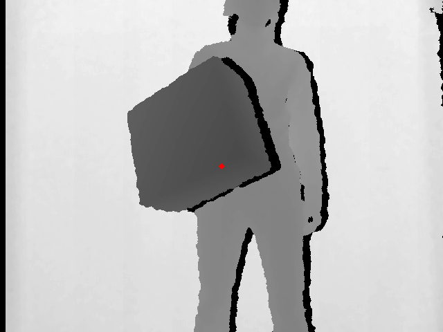
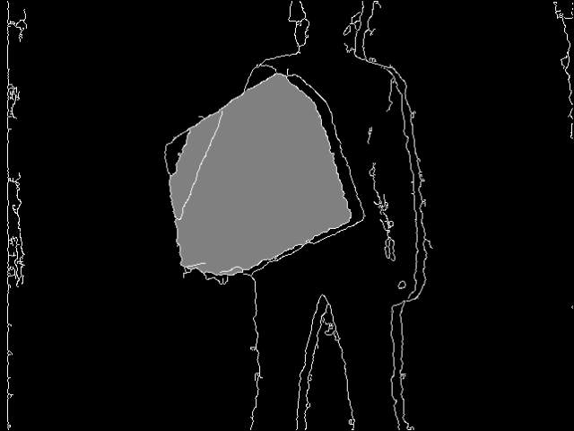

[BACK](https://mcarletti.github.io/)

*Last update: November 18th, 2018*

# Object segmentation in grayscale images

In computer vision, **image segmentation** is the process of partitioning a digital image into multiple segments (sets of pixels, also known as super-pixels). The goal of segmentation is to simplify and/or change the representation of an image into something that is more meaningful and easier to analyze. Image segmentation is typically used to locate objects and boundaries (lines, curves, etc.) in images. More precisely, image segmentation is the process of assigning a label to every pixel in an image such that pixels with the same label share certain characteristics.

In this article we segment an object starting from a depth image.
The procedure follows the following steps:

1. convert the image to a grayscale (single channel) image
1. prepare a segmentation mask which will be updated with the segment
1. run a region growing algorithm
1. enjoy :)

Segmentation is far to be a trivial task. Here we do not provide any specific overview on the strategies one could follow. Wikipedia gives an exhaustive [list of segmentation methods](https://en.wikipedia.org/wiki/Image_segmentation). However, if you are interested in this topic take a look to the [flood fill](https://en.wikipedia.org/wiki/Flood_fill) and [watershed](https://en.wikipedia.org/wiki/Watershed_%28image_processing%29) algorithms. Here we will use the first one.

Sources: Wikipedia - Credits: https://vgg.fiit.stuba.sk/2013-07/object-segmentation/

# Code

<center>

<br>
<i>The red dot is the seed from which the segmentation has started.</i>
</center>

Assuming to have CV_8UC1 image (`depth`) which values are normalized between 0 and 255, we define the parameter for the segmentation stage:

```cpp
int width = depth.cols;
int height = depth.rows;

// used by the region growing algorithm
double V1 = 20.f;
double V2 = 20.f;

// position of the seed
int U = int(width / 2);
int V = int(height / 2);
```

Then, the segmentation is done using the floodFill algorithm:

```cpp
cv::Point2i seed;
seed.x = U;
seed.y = V;

cv::Mat mask;

// extract the edged
cv::Canny(depth, mask, 0, 255);
cv::copyMakeBorder(mask, mask, 1, 1, 1, 1, cv::BORDER_REPLICATE);
unsigned char fillValue = 128.f;

// fill the areas in which the seed is located
floodFill(depth, mask, seed, cv::Scalar(128), nullptr, cv::Scalar(V1), cv::Scalar(V2), 4 | cv::FLOODFILL_MASK_ONLY | (fillValue << 8));
cv::resize(mask, mask, depth.size());
```

Enjoy :)

To compile, use the following command:

```
g++ depthsegmentation.cpp -o depthsegmentation `pkg-config --cflags --libs opencv`
```

Example:
```
./depthsegmentation depth.png
```

## Download

* [depthsegmentation.cpp](src/depthsegmentation.cpp)
* [depth.png](src/depth.png)
